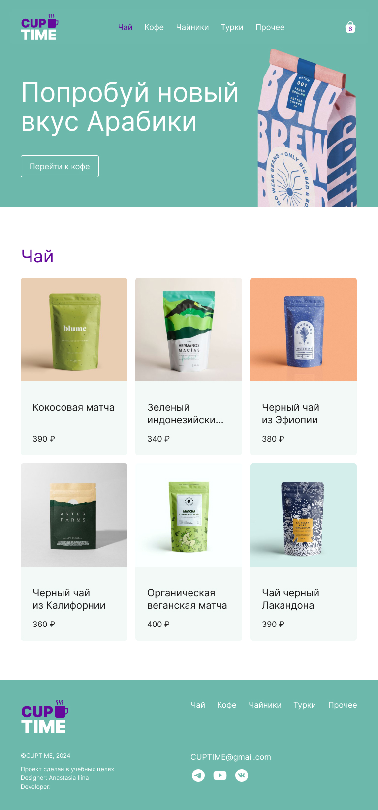

# Cup Time
Cup Time is a modern, responsive e-commerce web application built with React. It allows users to browse and purchase a variety of tea, coffee, teapots, and other related products.

## Features
* Product Catalog: Browse a wide selection of products categorized by type (tea, coffee, teapots, etc.).
* Shopping Cart: Add products to your cart and view the total price before placing an order.
* Order Placement: Submit your order through a simple checkout process.
* Responsive Design: Optimized for both desktop and mobile viewing.
* Skeleton Loaders: Enhances user experience by displaying loaders while content is being fetched.

## Technologies Used
* **React**: A JavaScript library for building user interfaces.
* **React Router**: For routing and navigation.
* **Context API**: To manage global state (Cart, Product, Order).
* **Vite**: A build tool that significantly improves the development experience.
* **CSS Modules**: For scoped and maintainable styling.
* **Vercel**: Deployment platform for modern web apps.
